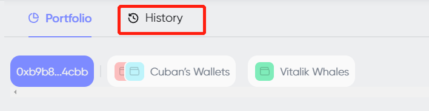
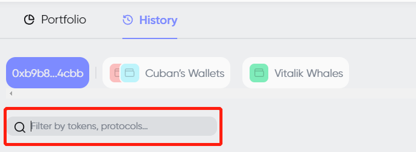
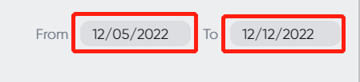
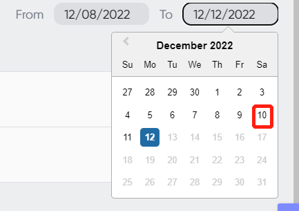
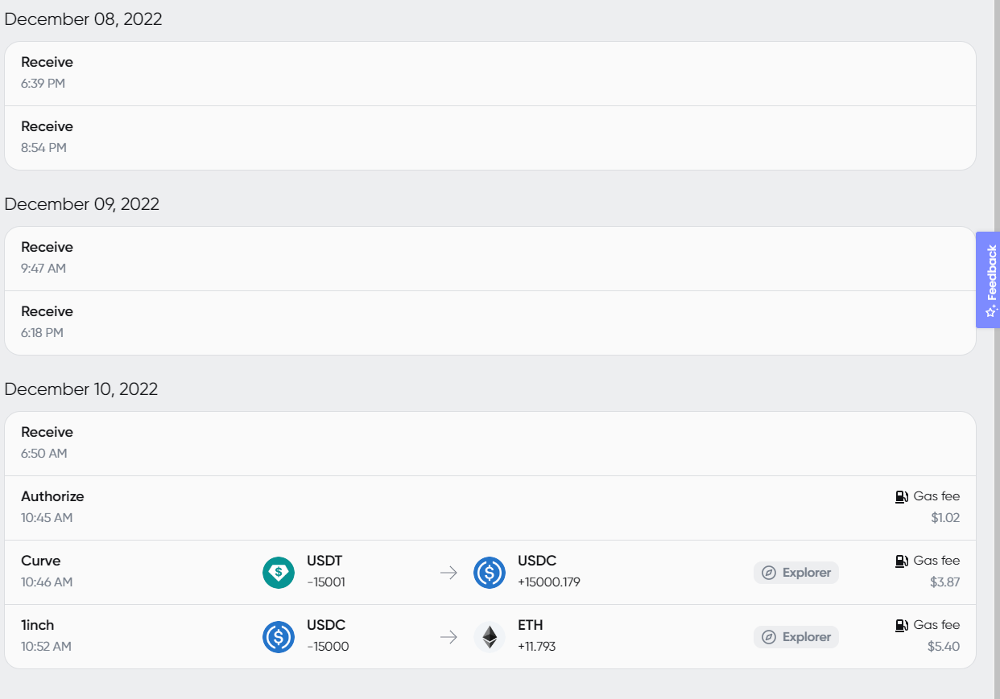
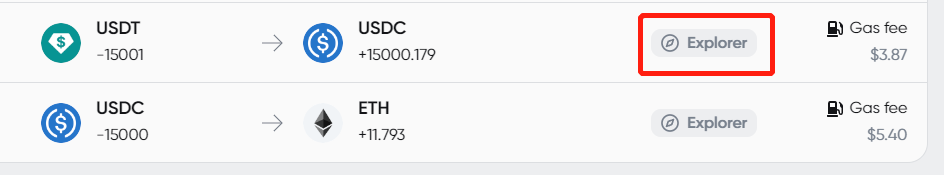
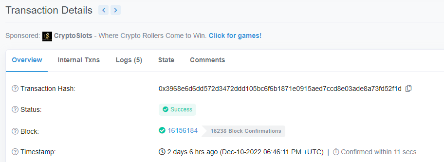
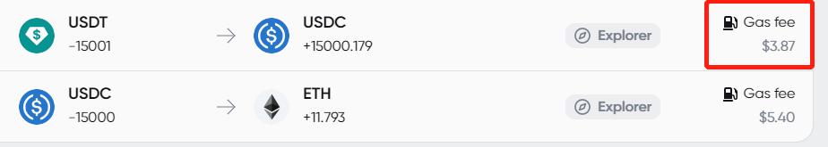

# How to check Transaction History

1. To check transaction history, Choose “History”

<figure><figcaption></figcaption></figure>

2. The transaction history interface:

<figure><figcaption></figcaption></figure>

3. If you wish to search for a designated tokens or protocols, find the filter column:

<figure><figcaption></figcaption></figure>

4. Take searching for “USDT” as an example, it will show up all the USDT transactions:

<figure><figcaption></figcaption></figure>

5. If you wish to search for transactions from a specific period, you can use the feature on the right. When you click the date, a drop-down menu pops up:

<figure><figcaption></figcaption></figure>

6. We use from “12/08/2022” as an example:

<figure><figcaption></figcaption></figure>

7. We use to “12/10/2022” as an example:

<figure><figcaption></figcaption></figure>

8. After choosing the date, the transactions within the chosen period will show up:

<figure><figcaption></figcaption></figure>

9. You can check the transaction id from the transaction history list.

<figure><figcaption></figcaption></figure>

10. After clicking the “Explorer” button, An Etherscan site shows up.

<figure><figcaption></figcaption></figure>

11. Gas fee will also be shown from this feature.

<figure><figcaption></figcaption></figure>
