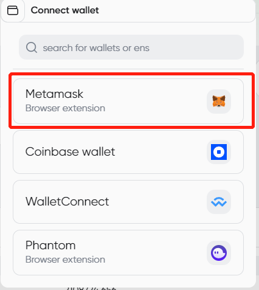
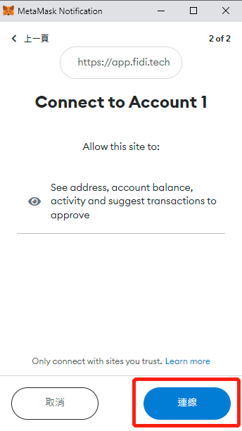
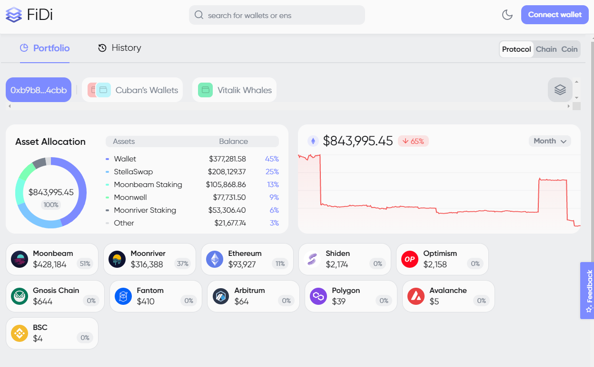

# How to use Portfolio Tracker

1. From the FiDi interface, click “connect wallet” on the top right.

<figure><figcaption></figcaption></figure>

2. You have 4 options to connect your wallet, in this guide, we will connect Metamask.

<figure><figcaption></figcaption></figure>

3. Choose the wallet you wish to connect, then click “Next”

<figure><figcaption></figcaption></figure>

4. Once confirm the information, click “Connect”

<figure><figcaption></figcaption></figure>

5. After the wallet connects successfully, you will see your wallet on the upper left.

<figure><figcaption></figcaption></figure>

6. Now you can see the interface of your wallet, the wallet allocation, the price history, your asset in categories, and your assets will be listed below.

<figure><figcaption></figcaption></figure>

7. The assets’ list can be viewed

* by chain
* by protocol
* by coin

<figure><figcaption></figcaption></figure>

8. If you choose by protocol, farming, staked, lending, and liquidity pool position will be shown in a separately list, the list will look like:

<figure><figcaption>
When users choose to view assets by protocol, their assets are categorized by essential sets of rules that empower data to be partaken between computers. The digital money in the protocol to be securely exchanged on a distributed, decentralized database.
</figcaption></figure>

9. If you choose by chain, all of your assets on one chain will combine together. From the below examples, you can see your assets in moonbeam including wallet, staked position, lending position, and farming position.

<figure><figcaption>
When users choose by chain, it means they are checking their assets based on a distributed, public, decentralized ledger that is described across a network. 
</figcaption></figure>

10. If you choose by coin, all the positions will be in one list. The lending, staked, liquidity pool and farming position will be shown by category:

<figure><figcaption>
When users check their asset by coin means they are viewing their independent cryptocurrency or digital cash regardless of the chain or platform.
</figcaption></figure>

11. If you wish to check a specific chain, you can click the chain you wish to view in the middle. Take moonbeam as an example, you can click the moonbeam icon:

<figure><figcaption></figcaption></figure>

12. You should see your assets on moonbeam after clicking the Moonbeam icon.

<figure><figcaption></figcaption></figure>
